# Tech Stack & Dependencies

وثيقة التقنيات والمكتبات المستخدمة في مشروع "منصة العقارات" (Real Estate Platform). يمكن عرض هذا الملف مباشرة في Notion / GitHub / Typora.

## نظرة عامة

| الطبقة | التقنية |
|---|---|
| لغة البرمجة | **PHP 8.2+** |
| إطار العمل (Backend) | **Laravel 12** |
| قاعدة البيانات | **MySQL 8.0** (Docker) / SQLite (التطوير المحلي) |
| الـ ORM | Eloquent ORM |
| المصادقة | **Laravel Fortify** + **Laravel Sanctum** (API Tokens) |
| الصلاحيات والأدوار | **Spatie Laravel Permission** |
| رفع وإدارة الوسائط | **Spatie Laravel Media Library** |
| التوثيق الفوري (Realtime) | **Pusher** (WebSockets) |
| الإشعارات الفورية (Push) | **FCM (Firebase Cloud Messaging)** |
| الدفع الإلكتروني | **Stripe** |
| توزيع المهام (Queues) | Redis + **Laravel Horizon** |
| الأدوات والتصحيح | **Laravel Telescope** + **Laravel Pail** |
| توثيق الـ API | **Scribe** |
| الاختبارات | **PHPUnit** (4 Suites) + Mockery + Faker |
| تنسيق الكود | **Laravel Pint** |
| الـ Frontend | **Vite** + **Tailwind CSS 4** + Axios |
| الخوادم (Docker) | **Nginx** + **PHP-FPM** + **MySQL (3307)** + **Redis (6380)** |

## بنية الـ Modules

المشروع مبني على نمط **Modular Monolith** — كل وحدة (Module) تحتوي على طبقاتها الخاصة:

```
Modules/
├── Auth            → المصادقة، الأدوار، الصلاحيات، طلبات الترقية
├── Core            → التصنيفات، المواقع (دول/مدن)، الملفات المؤقتة
├── RealEstate      → العقارات، الحجوزات، الإعلانات، البطاقات الإيجارية، التقييمات
├── Communication   → المحادثات، غرف الدردشة، الإشعارات، FCM
├── Subscription    → الخطط، الاشتراكات، الخصومات، Webhooks (Stripe)
├── Deposit         → الضمان المالي بين البائع والمشتري (Escrow)
├── ServiceProvider → مقدمي الخدمات، طلبات الخدمة، المهام
├── Crm             → العملاء المحتملين (Leads) وملاحظاتهم
├── FileSystem      → التخزين السحابي للمستخدم (ملفات/مجلدات)
├── Ledger          → المحاسبة المزدوجة، الرواتب، الدفعات
└── Statistics      → لوحات الإحصائيات
```

## الاعتماديات (Composer require)

| الحزمة | الإصدار | الغرض |
|---|---|---|
| `laravel/framework` | ^12.0 | إطار العمل |
| `laravel/fortify` | ^1.33 | المصادقة |
| `laravel/sanctum` | ^4.0 | توكنات الـ API |
| `spatie/laravel-permission` | ^6.24 | الأدوار والصلاحيات |
| `spatie/laravel-medialibrary` | ^11.17 | إدارة الصور والملفات |
| `knuckleswtf/scribe` | ^5.6 | توليد توثيق الـ API |
| `laravel/horizon` | ^5.46 | لوحة الـ Queues |
| `laravel/telescope` | ^5.16 | تصحيح ومراقبة |
| `laravel/tinker` | ^2.10 | سكربتات تطورية |
| `predis/predis` | ^3.4 | عميل Redis |
| `pusher/pusher-php-server` | ^7.2 | WebSockets |
| `stripe/stripe-php` | * | الدفع الإلكتروني |

## الاعتماديات التطويرية (require-dev)

`phpunit/phpunit ^11.5` · `laravel/pint ^1.24` · `laravel/sail ^1.41` · `laravel/pail ^1.2` · `mockery/mockery ^1.6` · `fakerphp/faker ^1.23` · `nunomaduro/collision ^8.6`

## بنية الطبقات (Architecture)

```
Route (api.php)  →  Controller  →  Service (Business Logic)  →  Eloquent Model
                        │                    │                         │
                    DTOs (input)          DTOs (input)           Filters/Scopes
                        │                    │
                   ApiResponses         Resources (JSON output)
                        │                    │
                  ResponseBuilder      BaseJsonResource
```

## Diagram Tech Stack (Mermaid)

```mermaid
graph LR
    Client[Mobile / Web Client] -->|REST API + JSON| API[Laravel 12 API]
    API --> Auth[Fortify + Sanctum]
    API --> Perm[Spatie Permission]
    API --> Media[Spatie Media Library]
    API --> DB[(MySQL 8.0)]
    API --> Redis[(Redis)]
    Redis --> Q[Horizon Queues]
    API --> Stripe[Stripe Payments]
    API --> Pusher[Pusher WebSockets]
    API --> FCM[FCM Push]
    API --> Scribe[Scribe API Docs]
    API --> Telescope[Telescope]
```



## أوامر التشغيل

```bash
composer setup          # تثبيت كامل (composer, .env, key, migrate, npm, build)
composer dev            # تشغيل متزامن (serve + queue + pail + vite)
composer test           # تشغيل الاختبارات
composer pint           # تنسيق الكود
php artisan scribe:generate   # توليد توثيق API
```
